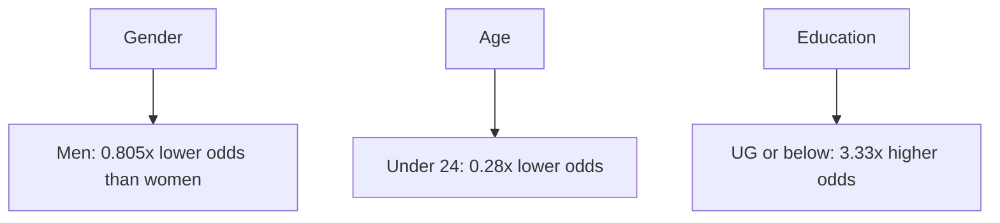

# 🤖 AI Text Detection Analysis Project

[](https://www.r-project.org/)
[](https://www.python.org/)

## 📊 Overview
This project analyzes people's ability to distinguish between AI-generated and human-written text through a statistical analysis of survey responses. The study involved 158 participants who evaluated eight different text samples, with demographics spanning various education levels, ages, and genders.

## ✨ Key Findings

| Demographic Group | Accuracy Rate |
|------------------|---------------|
| Undergraduate or below | 73.95% |
| Above undergraduate | 64.10% |
| Under 24 years | 70.45% |
| Above 24 years | 76.92% |
| Females | 74.60% |
| Males | 69.47% |

## 📝 Data Collection
- **Survey Size**: 158 respondents
- **Question Format**: 8 questions (4 AI-generated, 4 human-written)
- **Categories Covered**:
  - 🕉️ Religion
  - 🗳️ Political campaigning
  - 🔬 Scientific facts
  - 🩺 Female hygiene

## 🔍 Methodology
### Model Choice
We implemented a logistic regression model with:
- **Dependent Variable**: High_Ability (Yes/No, threshold ≥4 correct answers)
- **Independent Variables**: 
  ```
  - Sex (Male/Female)
  - Age (Below/Above 24)
  - Education (UG and below/Above UG)
  ```

## 📈 Statistical Analysis Results
### Odds Ratios


## 📂 Project Structure
```bash
├── 📊 Form_Responses.csv    # Raw survey data
├── 📜 V2.R                 # R script for analysis
└── 📈 plot.pdf             # Visualization of results
```

## ⚙️ Requirements
### Required Software
- R programming environment
### Required R Packages
```R
install.packages("ggplot2")
install.packages("stats")  # for glm function
```

## 🚀 Usage
1. Clone the repository
   ```bash
   git clone (https://github.com/MujtabaJ30/Statistics-Project-Abililty-to-identify-AI-Genreated-text/tree/main)
   ```
2. Ensure all required R packages are installed
3. Update the file path in `V2.R` to point to your local copy of `Form_Responses.csv`
4. Run the R script to perform the analysis

## 👥 Contributors
| Name | Enrollment Number |
|------|------------------|
| Prasham Pinkesh Shah | AU2120137 |
| Gautam Nipesh Shah | AU2120227 |
| Shubham Shah | AU2120064 |
| Mujtaba Jafri | AU2120119 |

## 📚 References
1. [How To Run Logistic Regression In R](https://www.nbshare.io/notebook/756634696/How-To-Run-Logistic-Regression-In-R/)
2. [Logistic Regression in R Tutorial - DataCamp](https://www.datacamp.com/tutorial/logistic-regression-R)
3. [How to Perform Logistic Regression in Excel - Statology](https://www.statology.org/logistic-regression-excel/)

---
<div align="center">
    <b>Made with ❤️ by Group 14</b>
</div>
